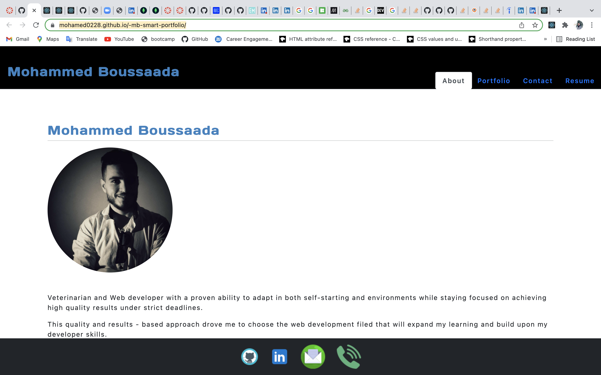
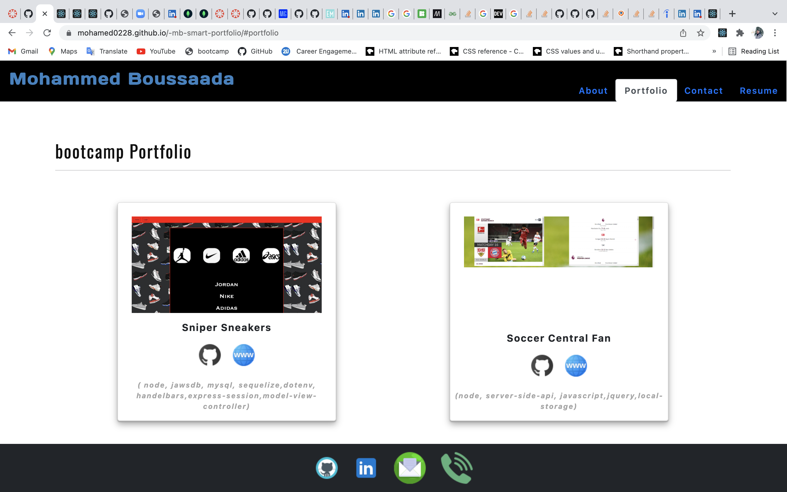
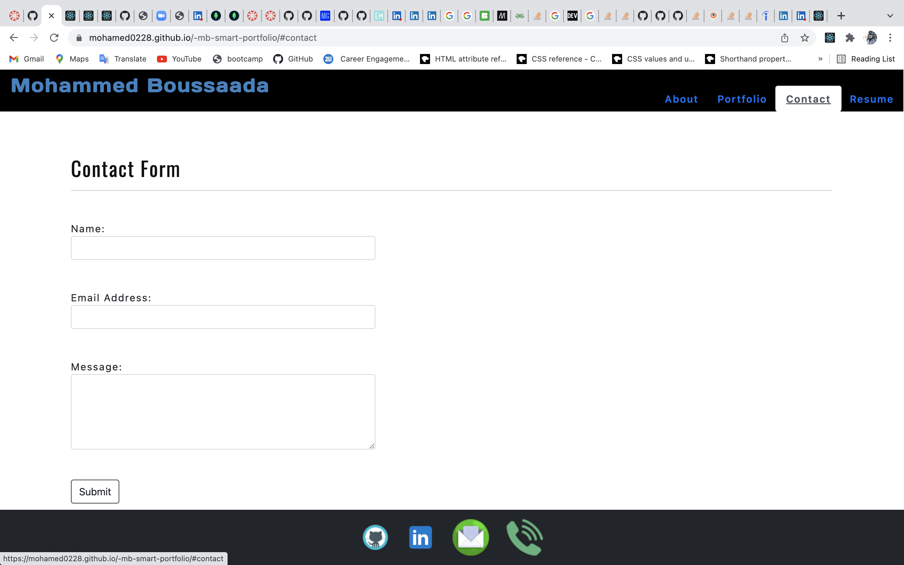

# mb-smart-portfolio
 

## Purpose
My protfolio website that shows my projects.
 ## Table of Contents

  * [Installation](#installation)
  * [Usage](#usage)
  * [Contributing](#contributing)
  * [License Info](#license-info)

 ### Technologies Used
* "react": "^17.0.2",
* "react-dom": "^17.0.2",
* "react-scripts": "4.0.3",

 ### Installation
  
  * N/A

  ### Tests

  * N/A

 ## Link to Deployed Application

https://mohamed0228.github.io/-mb-smart-portfolio/

## GitHub repository
https://github.com/mohamed0228/-mb-smart-portfolio

  ## Screenshots of Application
screenshots</img>
screenshots</img>
screenshots</img>

## Contributions
Made with ❤️ by [mohammed-boussaada]